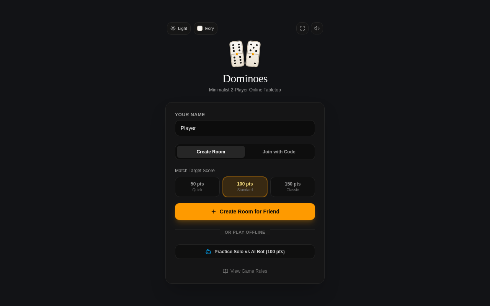

# Dominoes Online

A minimalist real-time two-player domino game for playing with friends via room codes. Created using Google AI Studio.

Live site: https://domino-game.ai.studio/



## Features

- Real-time multiplayer over WebSockets: create a room, share the 4-character room code (or invite link), and play.
- Standard draw-dominoes rules: 28-tile set, highest double opens, draw from the boneyard when you cannot play, pass if the boneyard is empty.
- Round ends when a player plays their last tile ("domino") or the game is blocked; the blocker with fewer pips wins the difference.
- Configurable target score per match (default 100 points), multi-round matches, and rematch voting.
- In-game chat, sound effects, and a solo/practice mode against a local bot.
- Mobile-friendly layout with orientation handling.

## Tech Stack

- React 19 + TypeScript, bundled with Vite
- Tailwind CSS 4
- Express + `ws` WebSocket server (`server.ts`)
- Game state is authoritative on the server; clients receive per-player sanitized room state (opponent hands are hidden until a round ends)

## Getting Started

Prerequisites: Node.js 18+.

```bash
npm install
cp .env.example .env   # fill in GEMINI_API_KEY if needed
npm run dev
```

The app runs at http://localhost:3000.

### Environment Variables

- `GEMINI_API_KEY`: required for Gemini AI API calls (injected automatically when deployed via Google AI Studio).
- `APP_URL`: the URL where the app is hosted (also injected by AI Studio).

## Scripts

- `npm run dev` - start the dev server (Express + Vite middleware) on port 3000
- `npm run build` - build the client and bundle the server into `dist/server.cjs`
- `npm start` - run the production server (serves `dist/`)
- `npm run lint` - type-check with `tsc --noEmit`
- `npm run clean` - remove build output

## Project Structure

```
server.ts          Express + WebSocket server, rooms, game broadcasting
src/
  App.tsx          Main app / screen routing (lobby, waiting room, game)
  gameLogic.ts     Pure game rules engine (dealing, valid moves, scoring)
  types.ts         Shared client/server message and state types
  components/      UI: GameBoard, PlayerHand, LobbyView, chat, modals, solo bot
  hooks/           useMultiplayer (WebSocket client connection)
  utils/           Audio effects and screen orientation helpers
```

## Deployment

This project was created in Google AI Studio, which deploys it to Cloud Run and injects the environment variables above automatically. The live deployment is at https://domino-game.ai.studio/.

## Screenshot

`assets/screenshot.png` shows the main lobby page, captured from the live site (1280x800 viewport). Replace it whenever the UI changes significantly.
